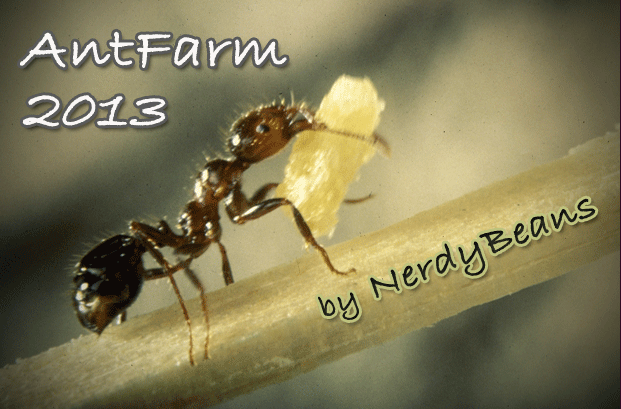
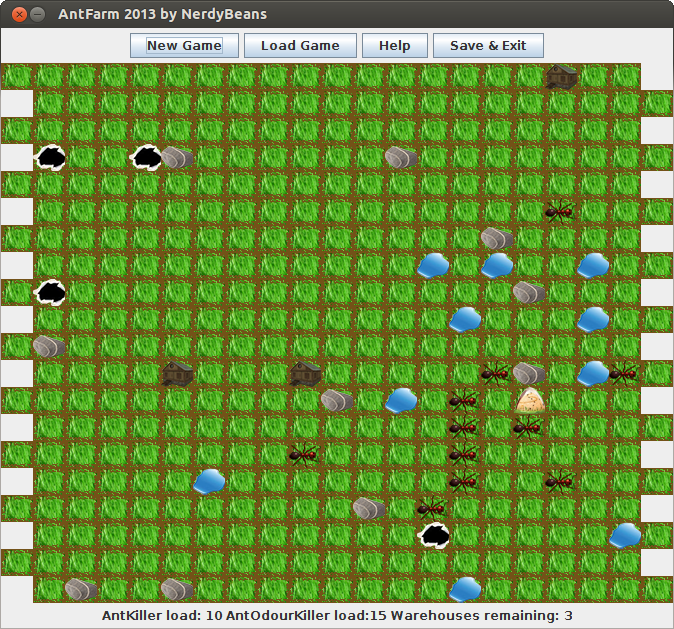

# Ant Farm

## Intro
Simple game developed using Rational Unified Process (RUP) in a semester-long course at Budapest University of Technology and Economics (BUTE).

The project involved object-oriented analysis & design, extensive documentation and implementation. Please not that this was our very first semester-long project, so the code might need some refactoring. However, the game is quite addictive itself! ;-)

_The developer team was called *NerdyBeans* and was formed by Benedek Horváth, Benedek Szabó, Gergely Dávid, György Demarcsek._

## How to compile and run the game?

**To compile the sources and play with the game you will need Java SE Development Kit (JDK) version 1.6 or newer installed.**

We created some scripts to make it easier to compile the sources and play with the game.

#### Windows

Execute the **compile.bat** to compile the sources. After that, run the **run.bat** to start the game.

### Linux

Execute the **compile.sh** to compile the sources. After that, run the **run.sh** to start the game.

## About the game

This is a single player Ant Farm game. The user has to save the foods stored in the three warehouses. The ants are moving continuously from the anthill to the warehouses to eat food from them. One ant can eat one unit food. There are 10 units in each warehouse. 

Moreover, each ant and food has its own odour. Ants are also able to follow other ant's odour and to smell the odour of the food stored in the warehouses.

Two utilities, the antkiller and the antodourkiller are available for the user. The former can be used 10 times clicking with the left mouse button, the latter can be used 15 times clicking with the right mouse button. The antkiller kills all ants in 3 radius around the clicked field. The antodourkiller removes the odour from the fields in 2 radius around the clicked field.

The game is over when all food are eaten by the ants.

## Screenshots from the game

